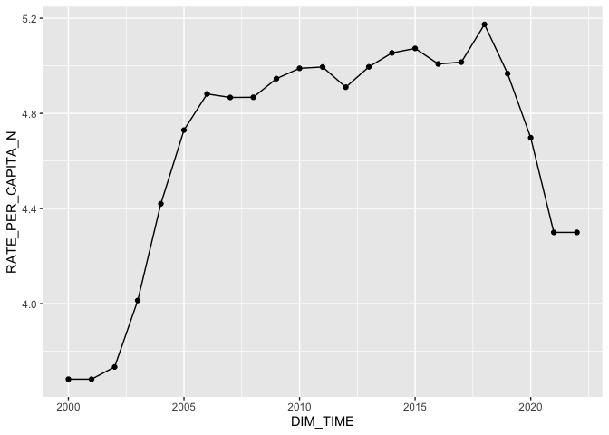
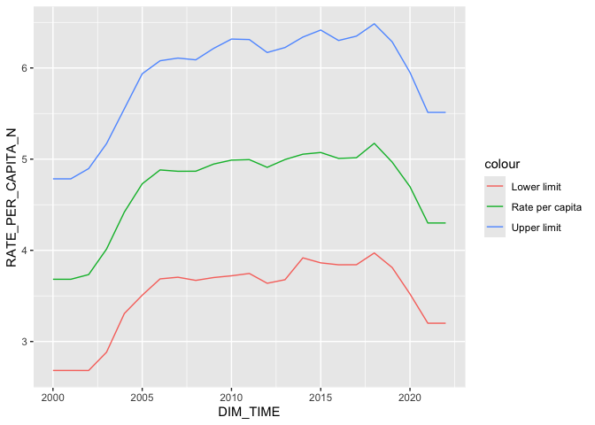
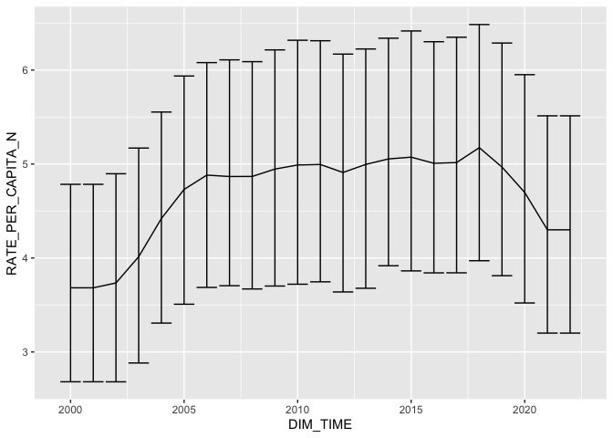
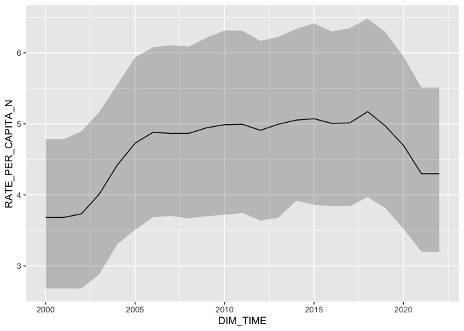

Simple graphs
================
Fiona Messer
2026-09-01

## Making simple plots

Now the data sets are nicely formatted I can start messing around with
plotting the data in fun and interesting ways.

Load the data from the `data_import_files` folder:

``` r
alcohol_country <- read.csv("alcohol_country.csv")
```

I will start by plotting the alcohol consumption data for a random
country over time. First, choose a country:

``` r
country <- unique(alcohol_country$GEO_NAME_SHORT)[[sample(1:length(unique(alcohol_country$GEO_NAME_SHORT)), 1)]]
filter(alcohol_country, GEO_NAME_SHORT == country)
```

    ##      X GEO_NAME_SHORT ParentLocationCode ParentLocation SpatialDimValueCode
    ## 1  162        Armenia                EUR         Europe                 ARM
    ## 2  163        Armenia                EUR         Europe                 ARM
    ## 3  164        Armenia                EUR         Europe                 ARM
    ## 4  165        Armenia                EUR         Europe                 ARM
    ## 5  166        Armenia                EUR         Europe                 ARM
    ## 6  167        Armenia                EUR         Europe                 ARM
    ## 7  168        Armenia                EUR         Europe                 ARM
    ## 8  169        Armenia                EUR         Europe                 ARM
    ## 9  170        Armenia                EUR         Europe                 ARM
    ## 10 171        Armenia                EUR         Europe                 ARM
    ## 11 172        Armenia                EUR         Europe                 ARM
    ## 12 173        Armenia                EUR         Europe                 ARM
    ## 13 174        Armenia                EUR         Europe                 ARM
    ## 14 175        Armenia                EUR         Europe                 ARM
    ## 15 176        Armenia                EUR         Europe                 ARM
    ## 16 177        Armenia                EUR         Europe                 ARM
    ## 17 178        Armenia                EUR         Europe                 ARM
    ## 18 179        Armenia                EUR         Europe                 ARM
    ## 19 180        Armenia                EUR         Europe                 ARM
    ## 20 181        Armenia                EUR         Europe                 ARM
    ## 21 182        Armenia                EUR         Europe                 ARM
    ## 22 183        Armenia                EUR         Europe                 ARM
    ## 23 184        Armenia                EUR         Europe                 ARM
    ##    DIM_TIME DIM_GEO_CODE_M49 DIM_GEO_CODE_TYPE RATE_PER_CAPITA_N
    ## 1      2016               51           COUNTRY          5.007728
    ## 2      2008               51           COUNTRY          4.867577
    ## 3      2018               51           COUNTRY          5.174070
    ## 4      2015               51           COUNTRY          5.073010
    ## 5      2017               51           COUNTRY          5.015269
    ## 6      2022               51           COUNTRY          4.299724
    ## 7      2007               51           COUNTRY          4.866960
    ## 8      2000               51           COUNTRY          3.682613
    ## 9      2002               51           COUNTRY          3.734096
    ## 10     2019               51           COUNTRY          4.967318
    ## 11     2013               51           COUNTRY          4.995565
    ## 12     2010               51           COUNTRY          4.989411
    ## 13     2004               51           COUNTRY          4.420078
    ## 14     2001               51           COUNTRY          3.682613
    ## 15     2005               51           COUNTRY          4.729659
    ## 16     2011               51           COUNTRY          4.994916
    ## 17     2003               51           COUNTRY          4.013392
    ## 18     2020               51           COUNTRY          4.697652
    ## 19     2012               51           COUNTRY          4.909939
    ## 20     2006               51           COUNTRY          4.881691
    ## 21     2021               51           COUNTRY          4.299724
    ## 22     2014               51           COUNTRY          5.054150
    ## 23     2009               51           COUNTRY          4.945955
    ##    RATE_PER_CAPITA_NL RATE_PER_CAPITA_NU
    ## 1            3.841440           6.301105
    ## 2            3.670373           6.088937
    ## 3            3.971025           6.484101
    ## 4            3.862664           6.415692
    ## 5            3.842109           6.348899
    ## 6            3.200610           5.512617
    ## 7            3.704968           6.108138
    ## 8            2.682676           4.783901
    ## 9            2.682296           4.896341
    ## 10           3.811616           6.287208
    ## 11           3.677810           6.224002
    ## 12           3.720784           6.316773
    ## 13           3.307314           5.552977
    ## 14           2.682676           4.783901
    ## 15           3.507888           5.936317
    ## 16           3.746315           6.311552
    ## 17           2.882714           5.169517
    ## 18           3.521269           5.950551
    ## 19           3.638725           6.169343
    ## 20           3.686876           6.078928
    ## 21           3.200610           5.512617
    ## 22           3.917446           6.338600
    ## 23           3.701532           6.214337

``` r
print(country)
```

    ## [1] "Armenia"

Next, plot a scatterplot with a line:

``` r
alcohol_country %>% 
  filter(alcohol_country$GEO_NAME_SHORT == country) %>%
  ggplot(aes(x=DIM_TIME, y=RATE_PER_CAPITA_N)) +
    geom_line() +
    geom_point()
```

<!-- -->

Plot made, can I add the upper and lower estimates as well?

``` r
alcohol_country %>% 
  filter(alcohol_country$GEO_NAME_SHORT == country) %>%
  ggplot(aes(x=DIM_TIME)) +
    geom_line(aes(y = RATE_PER_CAPITA_N, colour = "Rate per capita")) +
    geom_line(aes(y = RATE_PER_CAPITA_NL, colour = "Lower limit")) +
    geom_line(aes(y = RATE_PER_CAPITA_NU, colour = "Upper limit"))
```

<!-- -->

Alternatively with error bars:

``` r
alcohol_country %>% 
  filter(alcohol_country$GEO_NAME_SHORT == country) %>%
  ggplot(aes(x=DIM_TIME)) +
  geom_line(aes(y = RATE_PER_CAPITA_N)) +
  geom_errorbar(aes(ymin = RATE_PER_CAPITA_NL, ymax = RATE_PER_CAPITA_NU))
```

<!-- -->

Which looks ugly. Try the `geom_ribbon()` function instead.

``` r
alcohol_country %>% 
  filter(alcohol_country$GEO_NAME_SHORT == country) %>%
  ggplot(aes(x=DIM_TIME, y = RATE_PER_CAPITA_N, ymin = RATE_PER_CAPITA_NL, ymax = RATE_PER_CAPITA_NU)) +
  geom_line() +
  geom_ribbon(alpha = 0.25)
```

<!-- -->
